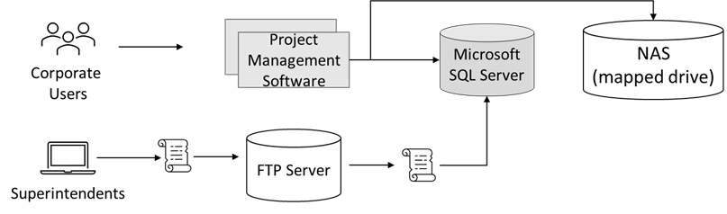
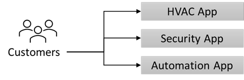

---
casestudy:
    title: 'Fabrikam Residences'
    module: 'Logging and monitoring solutions'
---
# Case Study: Fabrikam Residences

## Requirements

**This case study requires you to have completed the following modules and case studies:  Compute, relational data, non-relational data, authentication, application architecture**

You have taken a new position with Fabrikam Residences, which is very successful and is experiencing rapid growth. Fabrikam Residences is a building contractor for new homes and major home renovations and have become successful by providing quality buildings and offering newer integrated home technologies than their competitors.  

Currently these technologies are provided and managed by separate sub-contract companies. The owners of Fabrikam Residences want to begin offering these upgraded technology options in-house to provide better quality, support and data on customer patterns and needs. 
 
Initially, the company wants to offer HVAC (heating and cooling) control and monitoring, security system monitoring and alerts, and home automation. This will require a new website, data storage solution and data ingestion solution.

The company has seen tremendous growth over the past 2 years. The company is estimating it may double in size over the next 12-18 months. With such rapid growth in the regional market, the company has no current plans to expand outside of the regional market.

## Current Situation

The Fabrikam Headquarters operates a small datacenter in a single location. The datacenter hosts the company **Project Management (PM) software**.

- The PM software uses a third-party Windows application. The application runs on a 2-node Network Load Balancing (NLB) cluster with a single Microsoft SQL Server backend.  

- Images and documents are stored on a mapped drive of the server, which resides on a dedicated NAS appliance.

- Corporate users, office staff, use a web front end to enter data such as supply delivery schedules and change orders.

-	Field superintendents use Windows laptops and tablets offline to continuously record building progress and other details.  These changes, such as new work orders, are stored in a local change file .  At the end of each day, superintendents return to the office to connect to the wireless network and run a small script to upload the change file to an FTP server.  A second script is scheduled to run each night to processes all the change files and enter their contents into the Project Management database (Microsoft SQL Server).

The **Home Technology software** is currently provided and hosted by third parties and involves at least three different websites the customer must visit.  It is proposed the software be replaced with an in-house developed and unified solution.

## Requirements 

**Project Management software**

- Migrate as many of the systems to a public cloud provider as possible.

- Replace the existing scripts to leverage a system more secure than FTP, as security concerns have arisen. Also, you have been asked to make sure that change files are processed as soon as they are uploaded.

- Increase the resilience of the project management database. While performance is not an issue, the company would like to avoid losing access to the database in case of a single hardware failure.

**New Home Technology Solution**

- Add a new solution to collect data continuously from the home monitoring sensors.
  - Database some sensor readings for trend analysis and reporting.
  - Provide configurable real-time alerting based on owner needs.
  
- Design a relational database solution to hold homeowner preferences and settings.
  - System must be scalable.
  - Redundancy is critical.
  
- The new unified website will be developed in house and hosted on Linux.  This website will be used to view monitors and change preferences for items such as temperature or alert thresholds. Loads can vary widely, and the system must be able to scale quickly.

-	Provide users a way to sign into the system without creating another user account and password.

- Implement security controls and provide weekly reports outlining how the company matches up against industry standard best practices.

## Tasks 

1. Design a solution for the Project Management software. Be prepared to explain why you chose each component of the design and how it meets the solution requirements.

2. Design an architecture for the New Home Technology Solution. Be prepared to explain why you chose each component of the design and how it meets the solution requirements.

How are you incorporating the Well Architected Framework pillars to produce a high quality, stable, and efficient cloud architecture?

